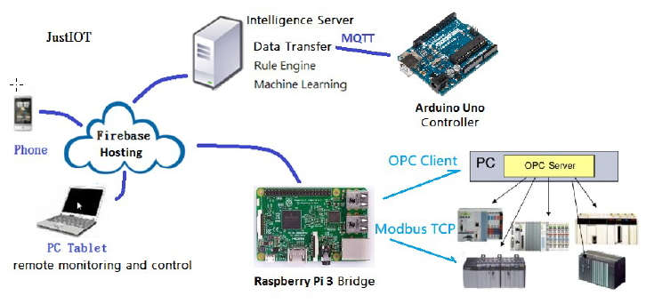
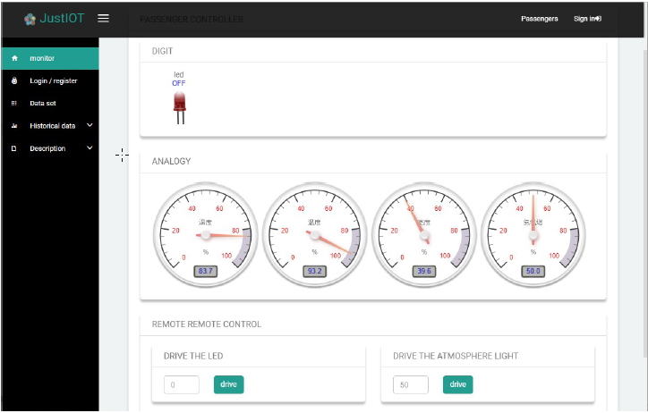
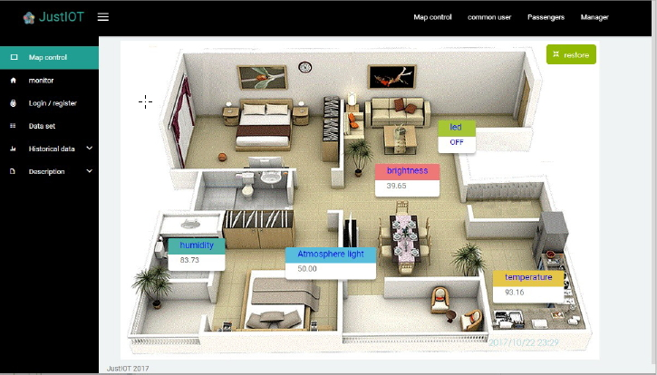
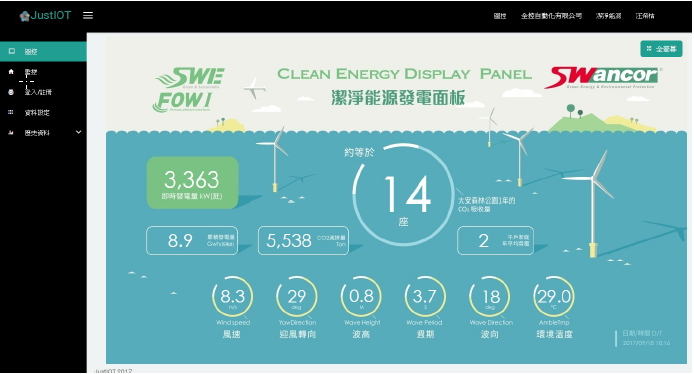

JustIoT Internet of Things based on the Firebase Real-time Database

Cloud Supervisory Control System Based on JustIoT

This project is Based on  [blur-admin](https://github.com/akveo/blur-admin).

The source codes are in justiotsrc directory.

Reference:
1. [JustIoT Internet of Things based on the Firebase Real-time Database, February 2018, Proceedings of the 2018 International Symposium on Semiconductor Manufacturing Intelligence (ISMI2018) At: Hsinchu, Taiwan.](https://www.researchgate.net/publication/323342152_JustIoT_Internet_of_Things_based_on_the_Firebase_Real-time_Database)
2. [Cloud Supervisory Control System Based on JustIoT, February 2018, Proceedings of the 2018 International Symposium on Semiconductor Manufacturing Intelligence (ISMI2018)At: Hsinchu, Taiwan.](https://www.researchgate.net/publication/323342314_Cloud_Supervisory_Control_System_Based_on_JustIoT)
